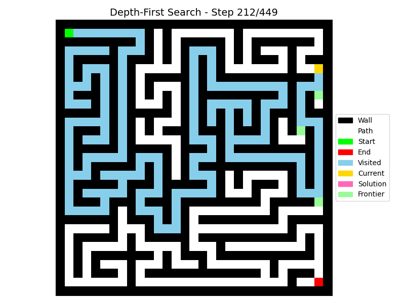
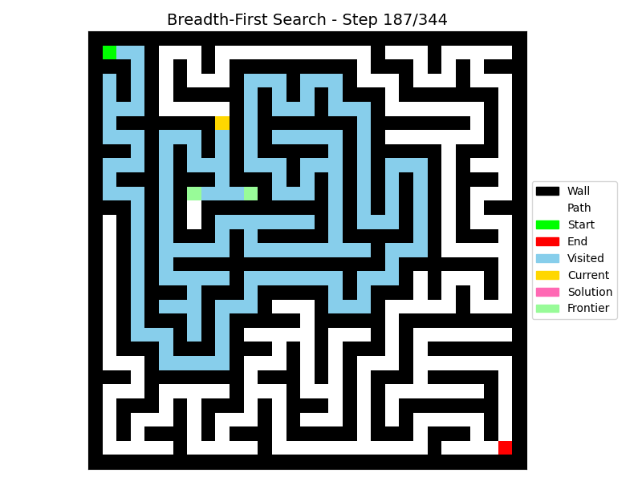

# Maze Solver — Animated Pathfinding Visualizer

A Python maze solver showcasing DFS, BFS, A*, and Dijkstra pathfinding algorithms with real-time Matplotlib animations.

## Features
- Random maze generation using a recursive backtracker or a fixed test maze
- Implementations of DFS, BFS, A*, and Dijkstra
- Animated visualization of the search process using Matplotlib
- CLI to select algorithm, maze size, and animation speed
- Reconstructs and highlights the final solution path

## Quick demo
Replace these placeholders with screenshots or GIFs from your runs:       
 — DFS animation(Demo)
 - 
 — BFS animation(Demo)
 - 

To create GIFs from Matplotlib animations, save frames and stitch them with `ffmpeg` (optional).

## Requirements
Tested on Python 3.13.

`requirements.txt`
